# *Peace Fitness:*
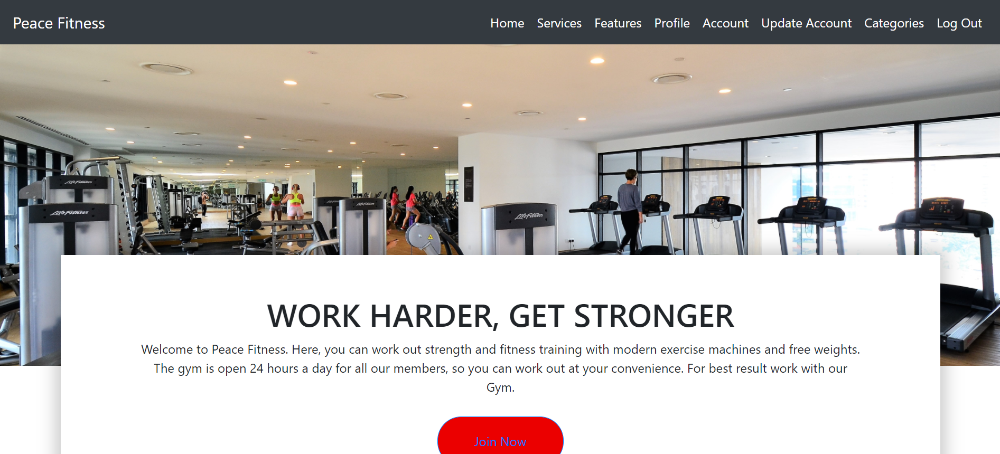
  
Peace Fitness is a general body fitness center for good health and personal develop. The ability to deliver your goal with excellence through a progressive actualization of a predetermined goal. 
The goal is to encourage members work header and get stronger while living a healthy life style.
The gym provides different services that would help members remain focus towards achieving thier goals. It has flexible opening hours and personal trainer that would fit individual time table. 

 
## UX

### User Goals

* Give opportunity to people interested in living a healthy life style- through gymn activities.

* For people who are interested in exercising.

* People who have been recommended for medical rehabilitation to work on certain part of their body.

* People who love to keep fit and body shapes.

* For people who want to loss weight and keep fit.

### Business Goals

* To create a business platform where people can register and be a member for a fee to meet their fitness needs.
* A business where all registered users can have access to special trainers and training regime.

* Create a platform where registered users can log-in to their account and record their activities in the gym for future evaluation.

## User Story

#### Persona

* Akinz has been struggling with controlling his weight because he cannot keep track of his training regime and dieting, he found out about Peace Fitness on the web and decided to explore, he found he can do:

* Register his own account.
* Train with different expert trainers.
* Keep track of his training on his own account page.
* Keep track of his diet on his account page.

Afterwards Akinz decided to register and give it a trial.
            
 ## Design Choice

 ### Fonts

 * Lato
 * San Serif

 ### Colour

 

 ## Wireframes

 ### Desktop View

### Tablet View

### Mobile View

## Features

* Navigation Bar: Allow users to go to different sections of the website.
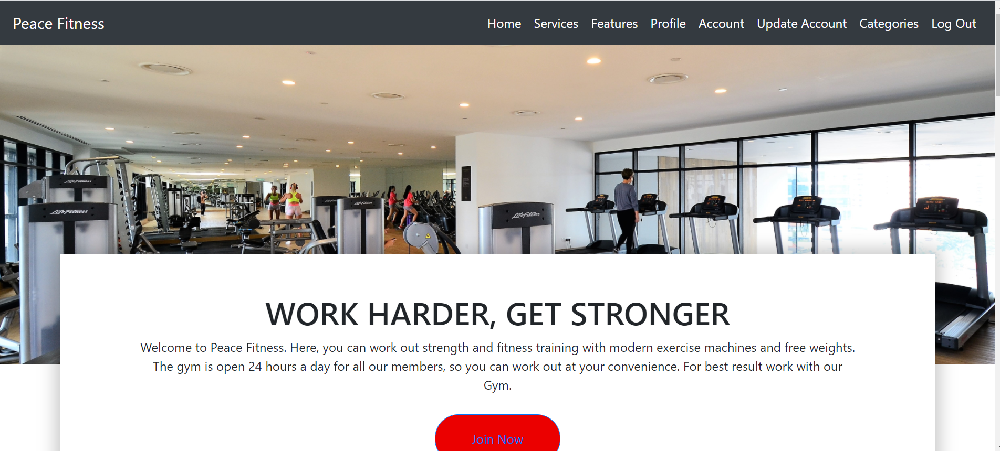

* Register: All users must register and they use this medium.
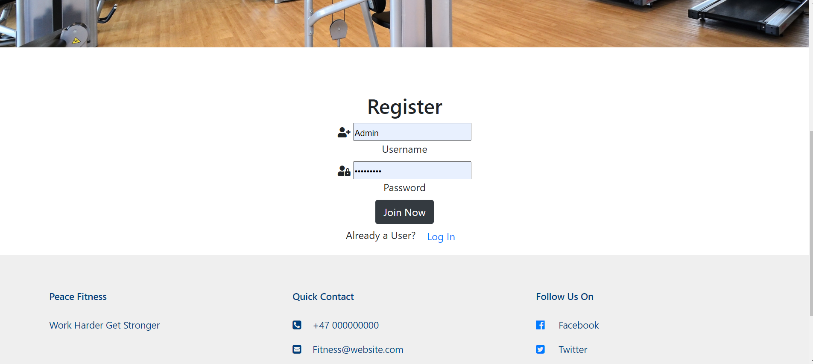

* Login: All registered users log-in to their account through this medium.
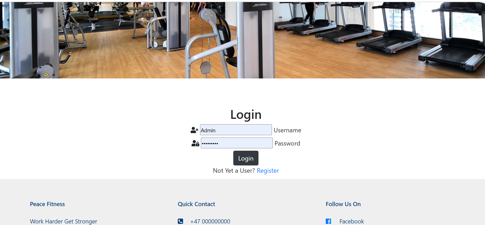

* Log Out: All registered users can safely log out from their account through this medium.
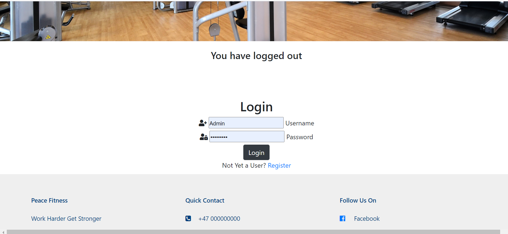

* Account: Users can save their training programmes and details on their account page using this medium. It is specific to only logged-in user.
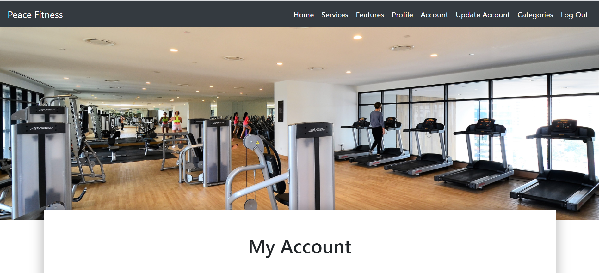
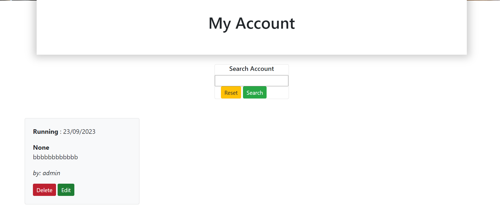

* Update Account: All registered users are allowed to update information on their account through this medium.
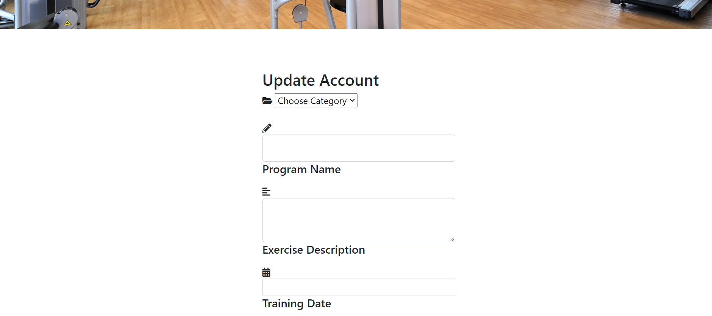

* Categories: As owners, a category section to set what users can store in their account and  these can also be update through Edit category.
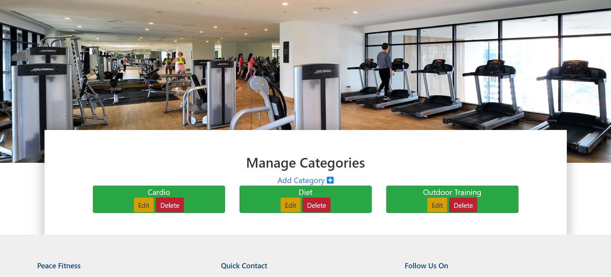
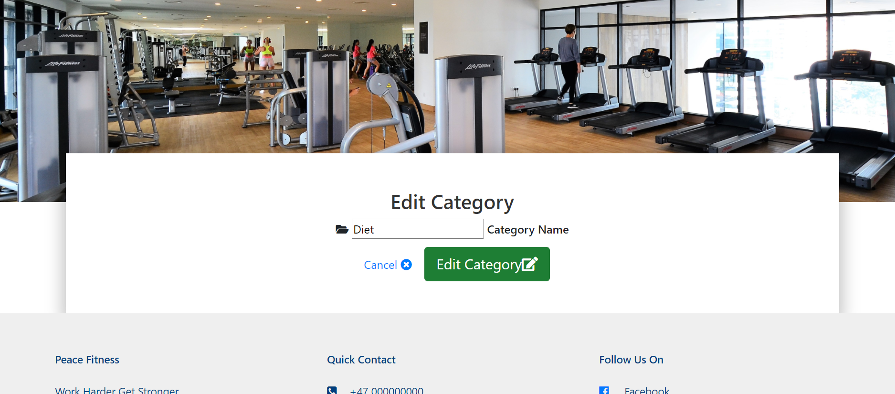

* Search: Users can quickly search through information on their account without having to scroll through all information.
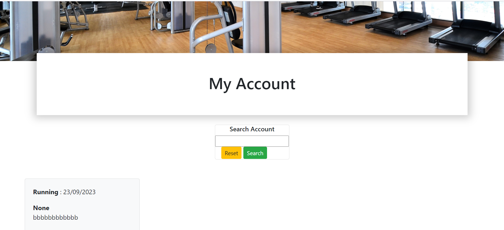

* Delete Confirmation: A confirmation is required before any delete action is effected.

## Technology Used

### Programming Language

* HTML
* CSS
* PYTHON
* HEROKU 
* MONGODB

### Database

* MongoDB

### Libraries

* Font Awesome
* Bootstrap for styling and application surface complaince.
* Jinga frameworks for template inheritance and code-reusability.
* Jquery for DOM Manipulation.

### Testing

The following tools were used for testing for code validation and beauty purpose:

* Freeformatter used to beautify the HTML code.
* BeautyTools used to beautify and validate the Javascript and CSS codes.
* Sentry trial version to debbug python scripts for error.

I carried out the following checks to test the website:

* I clicked the Navigation bars and buttons on this website to ensure all links go to indended pages and the buttons functions as intended. 

* I checked that authentication requires a username and password to login.

* I tried to login with a fake user id and it responded not yet a user.

* I tried registration with a user id and it return already a user.

* I checked to be sure that only the admin can update or delete a category. 

* I checked to be sure that users are only allowed to see their Account page.

### Limitations

* User profile can be made better with user details and other relevant information.
* A booking section where users can book and pay for their training sessions with trainers.
* A video upload will be better for users, to have online training sessions.
* A live chat will be a great addition to help users having problems on the platform.

### Deployment

Peace Fitness is deployed on Github, connected to Heroku with automatic update with every Git Push. Necessary Files required by Heroku such as Procfile and requirements.txt have been added and sensitive folders gitignored.

To commit and push during deployment the following commands where used:

* git add -A
* git commit -m " text to represent what is being committed"
* git push

Below are the step I used to deploy on Heroku:
After creating account

* Clicked on Settings
* Reveal Configvars
* Assigned the appropriate values for the environment variables.

Below are the steps I used to create database on MongoDB:

After creating an account;
* Through Collections create DataBase.
* Assigned what categories, tips and users.
* Created a list on the training index to enable search.

#### Github url: 
* https://github.com/zappyemem/PeaceFitness

#### Heroku url:
* https://peace-fitness.herokuapp.com/

### Credits:

* This project draws inspiration from Code Institute Mini Project however it has been modified to suit the purpose of Peace Fitness Gym Website.
* Bootstrap for html template styling.
*  https://www.youtube.com/watch?v=dam0GPOAvVI&t=16s Was used as additional lessons for databased manipulation in Flask.
* https://www.youtube.com/watch?v=dam0GPOAvVI&t=16s Was used as additional lessons for session user in Flask
           
 Acknowledgements:
  I would like to say a special thank you to my mentor Gerard McBride, the student care support, Tutor Assistance, slack, community and student care for their tremendous support during the time of developing this project.
           
  I received inspiration for this project from my love for sports and gym. 

  Feel free to contact me through my email address zappy4chat@yahoo.com

